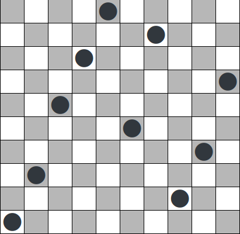

# The Ten Queens

Here is an example of how each solution will be in a chessboard.

None of the queens have the possibility of meeting in the first round because they don't intersect on lines, columns or diagonals.

